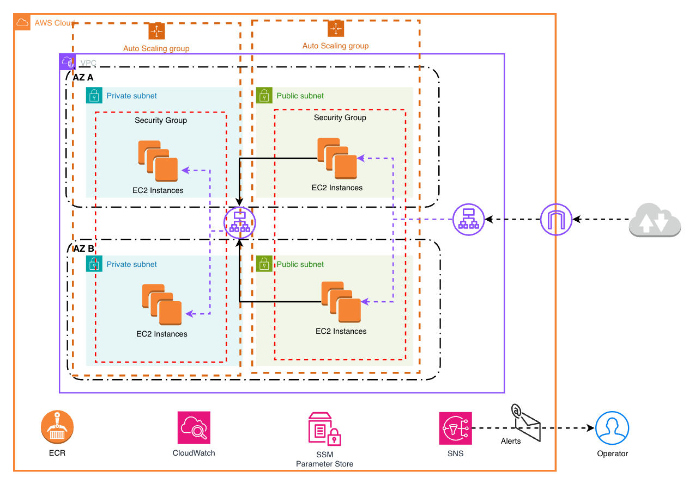
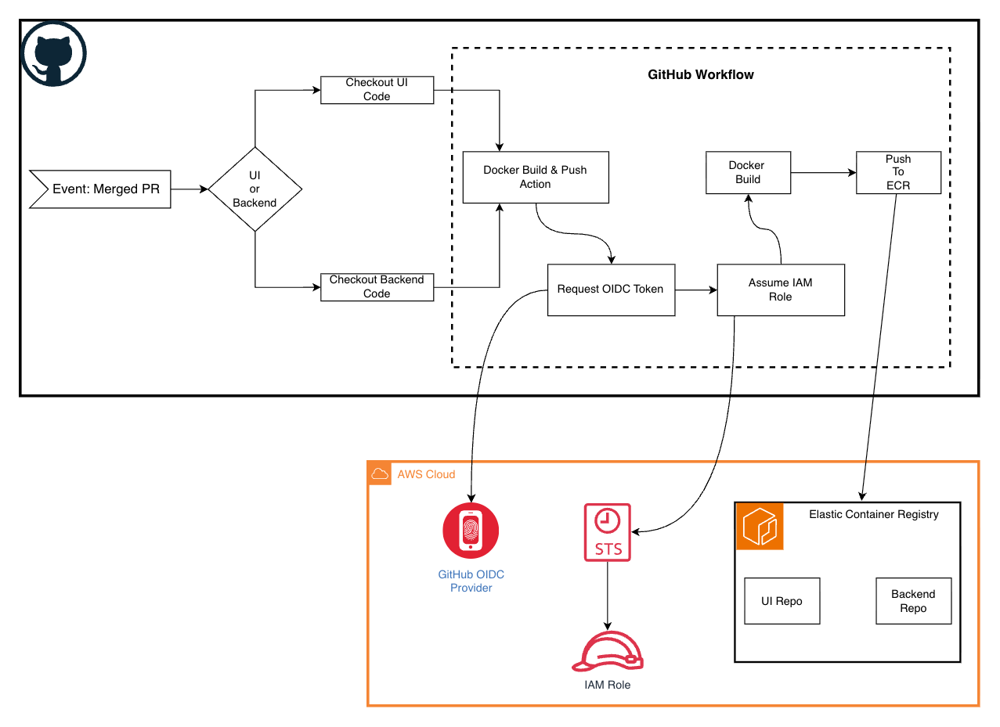

# OfferZen AWS Assessment

AWS infrastructure assessment project demonstrating cloud-native deployment patterns, infrastructure-as-code practices, and CI/CD automation.

## Architecture Overview

The infrastructure is deployed across multiple AWS Availability Zones for high availability and resilience. Below is the main deployment architecture:



### Core Components

#### Network Layer (VPC)

- **Multi-AZ Deployment**: Distributed across 2 availability zones (AZ A, AZ B)
- **Public Subnets**: Host internet-facing UI load balancers and EC2 instances
- **Private Subnets**: Host backend application instances with no direct internet access
- **Security Groups**: Granular network access controls for each tier

#### Load Balancing

- **External ALB (UI)**: Public Application Load Balancer for user-facing frontend traffic
    - Routes HTTP requests to UI EC2 instances in public subnets
    - Health checks ensure only healthy targets receive traffic
- **Internal ALB (Backend)**: Private Application Load Balancer for service-to-service communication
    - Routes internal API traffic between application tiers
    - Restricted to VPC CIDR block

#### Compute (Auto Scaling)

- **UI Tier**: Auto Scaling Group managing frontend instances
    - Spans both public subnets for availability
    - Scales based on demand and health metrics
- **Backend Tier**: Auto Scaling Group managing application servers
    - Deployed in private subnets for enhanced security
    - Isolated from direct internet access

#### Container Registry (ECR)

- Stores Docker images for both UI and backend tiers
- Environment-specific repositories: `{project}/{environment}/{tier}`
- Private repositories accessed via IAM and OIDC authentication

#### Monitoring & Alerting

- **CloudWatch**: Collects infrastructure and application metrics
    - ALB response times and error rates (5XX count)
    - Target group health status
    - Auto Scaling Group capacity metrics
- **SNS Topic**: Centralized alert notification channel
    - Email subscriptions for operator notifications
    - Extensible to Slack, PagerDuty, and other services

#### Systems Management

- **SSM Parameter Store**: Centralized configuration management
- **Systems Manager Session Manager**: Secure instance access without SSH keys

---

## CI/CD Pipeline

The project implements a secure deployment pipeline using GitHub Actions and AWS services:



### Workflow Steps

1. **Event Trigger**: Merged pull request to `main` branch
2. **Code Checkout**: GitHub Actions retrieves UI or backend source code
3. **Docker Build**: Builds containerized application image
4. **OIDC Authentication**: GitHub workflow requests OpenID Connect token from AWS
5. **IAM Role Assumption**: Exchanges OIDC token for temporary AWS credentials
6. **Container Push**: Authenticates to ECR and pushes image with commit SHA tag
7. **Immutable Tags**: ECR enforces immutable image tags to prevent overwrites

### Security Features

- **OIDC-based Authentication**: No long-lived AWS credentials stored in GitHub
- **Role-based Access Control**: Minimal IAM permissions scoped to ECR push only
- **Immutable Image Tags**: Ensures image integrity and traceability
- **Commit SHA Tagging**: Links deployed containers directly to source code

---

## Infrastructure as Code (IaC)

### Terraform Organization

```
infra/terraform/
├── main.tf                 # Root module composition
├── variables.tf            # Input variables
├── outputs.tf              # Output values
├── terraform.tfvars.example # Configuration template
├── providers.tf            # Provider versions and defaults
│
├── environments/           # Environment-specific configurations
│   ├── dev/dev.tfvars
│   └── prod/prod.tfvars
│
└── modules/                # Reusable Terraform modules
    ├── network/            # VPC, subnets, route tables
    ├── security/           # Security groups, NACLs
    ├── load_balancer/      # ALB and target groups
    ├── compute_asg/        # Auto Scaling Groups, launch templates
    └── monitoring/         # CloudWatch alarms, SNS topics
```

---

## References

- Docker for NodeJS: https://docs.docker.com/guides/nodejs/containerize/
- Express JS: https://expressjs.com/en/
- Terraform AWS Provider: https://registry.terraform.io/providers/hashicorp/aws/latest/docs
- Ansible AWS Collection: https://docs.ansible.com/ansible/latest/collections/amazon/aws/
